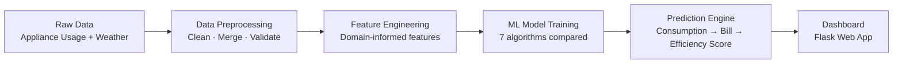
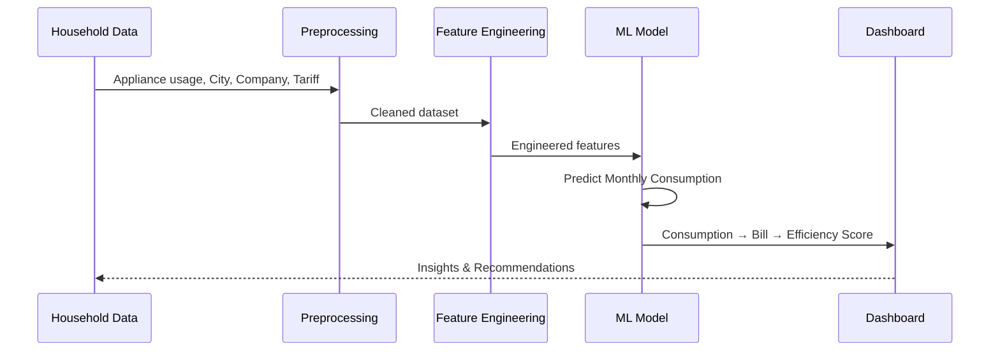
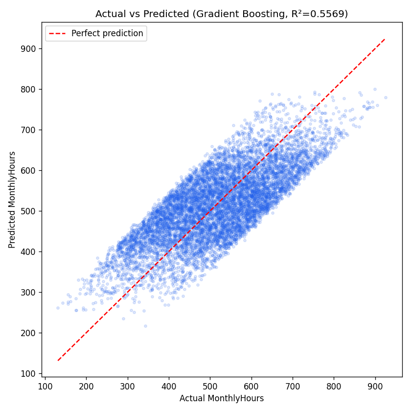
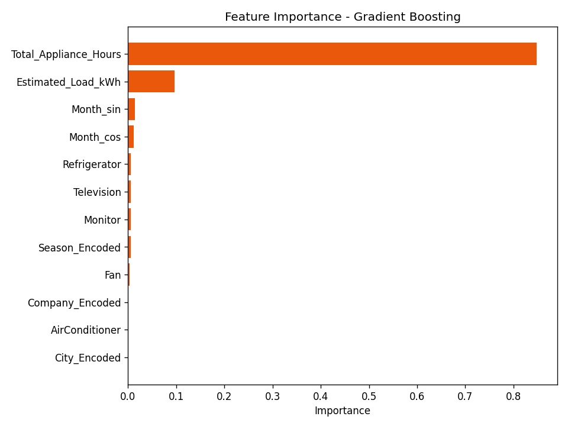

<div align="center">

# ⚡ SPARK
### Smart Power Analytics & Recommendation for Kilowatt Optimization

**A machine learning system that predicts household electricity consumption and turns raw appliance usage into actionable energy-saving insights.**


*Project Exhibition — I · DSN2098*

</div>

---

## 📑 Table of Contents

- [Overview](#-overview)
- [Problem Statement](#-problem-statement)
- [Features](#-features)
- [System Architecture](#-system-architecture)
- [Process Flow](#-process-flow)
- [Project Structure](#-project-structure)
- [Quick Start](#-quick-start)
- [Dataset](#-dataset)
- [Machine Learning Pipeline](#-machine-learning-pipeline)
- [Model Results](#-model-results)
- [Key Insights](#-key-insights)
- [Tech Stack](#️-tech-stack)
- [Applications](#-applications)
- [Future Improvements](#-future-improvements)
- [Team](#-team)
- [References](#-references)

---

## 🔎 Overview

**SPARK** predicts a household's **monthly electricity consumption** from its appliance usage patterns, then derives **estimated bills, energy efficiency scores, and personalized savings recommendations** from that prediction — built end-to-end from raw data to a trained, evaluated regression model.

> Consumption is *predicted*. Bill is *calculated*. That distinction is the backbone of this project's design — see [Key Insights](#-key-insights) for why it matters.

## 🎯 Problem Statement

Most households have no effective way to monitor or understand their electricity usage. Consumers can't easily identify which appliances drive their bill, forecast next month's cost, or spot inefficient usage patterns — leading to unnecessary energy waste, unpredictable bills, and missed opportunities for conservation.

## ✨ Features

| Feature | Description |
|---|---|
| 🔮 **Consumption Prediction** | Predicts monthly household electricity usage from appliance-level inputs using a trained ML regression model |
| 💰 **Smart Bill Estimation** | Converts predicted consumption into an estimated electricity bill using the household's actual tariff rate |
| 📊 **Usage Pattern Analysis** | Identifies which appliances and behaviors are driving consumption |
| 🌱 **Personalized Recommendations** | *(planned — dashboard layer)* AI-driven suggestions to reduce consumption and cost |

## 🏗️ System Architecture



| Stage | Description |
|---|---|
| **1. Data Preprocessing** | Cleans raw data, handles duplicates and constant columns, profiles outliers |
| **2. Feature Engineering** | Builds `Total_Appliance_Hours`, `Estimated_Load_kWh`, cyclical month encoding, seasonal buckets |
| **3. ML Model Training** | Trains and compares Linear Regression, Ridge, Decision Tree, Random Forest, Gradient Boosting, XGBoost, and SVR |
| **4. Prediction Engine** | Predicts monthly consumption, then computes monthly bill and efficiency score from it |
| **5. Dashboard** | Displays predictions and recommendations through an interactive Flask web application |

## 🔄 Process Flow



## 📁 Project Structure

```
SPARK_project/
├── data/
│   ├── electricity_bill_dataset.csv     # raw appliance/bill data (45,345 records)
│   ├── weather_raw.csv                  # raw Open-Meteo historical export
│   ├── monthly_climatology.csv          # Step 1 output — Month-level weather aggregation
│   ├── merged_dataset.csv               # Step 2 output — bill + weather joined on Month
│   ├── cleaned_dataset.csv              # Step 3 output — deduplicated, validated
│   └── engineered_dataset.csv           # Step 5 output — model-ready features
│
├── notebooks/
│   ├── 01_weather_climatology.py
│   ├── 02_merge_data.py
│   ├── 03_cleaning.py
│   ├── 04_eda.py
│   ├── 05_feature_engineering.py
│   ├── 06_train_test_split.py
│   ├── 07_model_training.py
│   ├── 08_evaluation.py
│   └── pipeline.py                      # standalone script — runs all 8 steps end-to-end
│
├── models/
│   ├── best_model.pkl                   # trained Gradient Boosting regressor
│   ├── scaler.pkl                       # StandardScaler fit on training data
│   ├── label_encoders.pkl               # LabelEncoders for City / Company / Season
│   └── model_meta.json                  # feature list, target, best model + metrics
│
├── reports/
│   ├── data_cleaning_log.json
│   ├── eda_business_insights.json
│   ├── correlation_with_target.csv
│   ├── feature_list.json
│   ├── feature_importance.csv
│   └── model_performance_comparison.csv
│
├── visuals/
│   ├── actual_vs_predicted.png
│   ├── residual_plot.png
│   ├── residual_distribution.png
│   └── feature_importance.png
│
├── docs/
│   └── Dataset_Documentation.md
│
├── app.py                               # Flask app (deployment — upcoming)
├── requirements.txt
└── README.md
```

## 🚀 Quick Start

```bash
# 1. Install dependencies
pip install -r requirements.txt

# 2. Run the full pipeline (preprocessing → training → evaluation)
python notebooks/pipeline.py

# Optional: skip chart generation for a faster run
python notebooks/pipeline.py --skip-plots

# 3. (Coming next) Launch the prediction dashboard
python app.py
```

## 📊 Dataset

- **45,345 household records** across **16 Indian cities** and **32 electricity distribution companies**
- **12 raw features**: appliance usage hours (Fan, Refrigerator, Air Conditioner, Television, Monitor, Motor Pump), Month, City, Company, Monthly Hours, Tariff Rate, Electricity Bill
- **Supplementary weather data**: historical hourly + daily weather (temperature, humidity, precipitation) from the [Open-Meteo Historical Weather API](https://open-meteo.com/en/docs/historical-weather-api), aggregated into a Month-level national seasonal climatology

Full schema, data dictionary, and known limitations are documented in **[`docs/Dataset_Documentation.md`](docs/Dataset_Documentation.md)**.

## 🔬 Machine Learning Pipeline

1. **Weather Climatology** — aggregates hourly/daily weather into a 12-month seasonal reference table
2. **Merge** — joins weather climatology onto the bill dataset by `Month`
3. **Cleaning** — duplicate removal, constant-column detection, IQR outlier profiling
4. **EDA** — correlation analysis, seasonal trend checks, auto-generated business insights
5. **Feature Engineering** — `Total_Appliance_Hours`, `Estimated_Load_kWh` (wattage-weighted), cyclical `Month_sin`/`Month_cos`, `Season`, encoded categoricals
6. **Train/Test Split & Scaling** — 80/20 split, `StandardScaler` fit on train only
7. **Model Training** — 7 algorithms compared with 3-fold cross-validation
8. **Evaluation** — MAE, RMSE, R², residual analysis, feature importance

## 🏆 Model Results

**Target variable:** `MonthlyHours` (predicted consumption) — **not** `ElectricityBill` directly. See [Key Insights](#-key-insights) for why.

| Model | MAE | RMSE | R² | CV R² (mean ± std) |
|---|---:|---:|---:|---|
| **🥇 Gradient Boosting** | **70.24** | **81.02** | **0.5569** | 0.5684 ± 0.0029 |
| 🥈 XGBoost | 70.25 | 81.02 | 0.5569 | 0.5682 ± 0.0033 |
| 🥉 Random Forest | 70.79 | 82.03 | 0.5459 | 0.5564 ± 0.0024 |
| Linear Regression | 70.94 | 82.31 | 0.5427 | 0.5561 ± 0.0032 |
| Ridge Regression | 70.94 | 82.31 | 0.5427 | 0.5561 ± 0.0032 |
| SVR (3k subsample) | 72.30 | 84.76 | 0.5151 | 0.5141 ± 0.0140 |
| Decision Tree | 72.90 | 85.52 | 0.5064 | 0.4978 ± 0.0020 |

**Best model: Gradient Boosting Regressor** — chosen for the highest test R² and the tightest, most stable cross-validation spread.

<div align="center">
 
</div>

## 💡 Key Insights

> **🚨 Leakage-aware target design.** `ElectricityBill = MonthlyHours × TariffRate` exactly, for every record in the dataset. Predicting `ElectricityBill` directly (using `MonthlyHours`/`TariffRate` as inputs) would produce a meaningless R² ≈ 1.0 — the model would just be learning multiplication. SPARK instead predicts **`MonthlyHours`** as the genuine ML problem, then computes the bill downstream: `predicted_bill = predicted_hours × tariff_rate`.

- **`Total_Appliance_Hours` is the dominant driver** of consumption — 84.9% feature importance in the final model, far ahead of any individual appliance.
- **Weather has ~zero effect on consumption in this dataset** (correlation < 0.04 for every weather variable). This was tested, not assumed — see the EDA report. Air Conditioner usage was found to be essentially flat across all 12 months, so no seasonal appliance behavior exists to correlate against.
- **No single appliance dominates individually** — Television, Fan, Refrigerator, Monitor, and Air Conditioner each correlate 0.27–0.43 with consumption; it's their *sum*, not any one of them, that matters most.
- **R² ≈ 0.56 is an honest ceiling**, not a shortfall — residuals are unbiased (mean ≈ 0.15) and symmetric, meaning remaining variance reflects real-world noise rather than a systematic model failure.

## 🛠️ Tech Stack


## 🌐 Applications

| Domain | Use Case |
|---|---|
| 🏠 **Residential Energy Management** | Optimize household electricity consumption and reduce costs |
| 🏢 **Utility & Power Companies** | Forecast electricity demand and analyze usage patterns at scale |
| 🌍 **Energy Awareness Platforms** | Promote responsible electricity usage through AI-driven insights |
| 🏙️ **Smart Cities** | Support sustainable, energy-efficient infrastructure planning |
| 🏡 **Smart Homes** | Intelligent monitoring of household energy consumption |

## 🔭 Future Improvements

- [ ] Fetch **per-city weather data** instead of a single national proxy, once city-level geolocation data is available
- [ ] Build the **Flask dashboard** (`app.py`) for interactive predictions and recommendations
- [ ] Add **SHAP-based explainability** for per-prediction transparency
- [ ] Support **real smart-meter time-series data** for finer-grained, sub-monthly predictions
- [ ] **Hyperparameter tuning** (GridSearchCV / Optuna) on the tree-based models
- [ ] Containerize with **Docker** for one-command deployment

## 👥 Team

| Name | Roll No. |
|---|---|
| Suhani Boxi | 25BAI10011 |
| Joydeep Samanta | 25BAI11045 |
| Dhairya Garg | 25BAI10224 |
| Srishti Rai | 25BAI10554 |
| Ashmita Ganguly | 25BAI10010 |
| Ujjaval Gupta | 25BAI11102 |

**Project Supervisor:** Dr. Harshlata Vishwakarma
**Reviewer I:** Dr. Velmani Ramasamy · **Reviewer II:** Dr. Amrita Parashar

## 📚 References

**Government & Industry Sources**
- Ministry of Power · Bureau of Energy Efficiency (BEE) · Smart Meter National Programme (SMNP)

**Datasets & APIs**
- [Open-Meteo Historical Weather API](https://open-meteo.com/en/docs/historical-weather-api)
- [Indian Household Electricity Consumption Dataset (Kaggle)](https://www.kaggle.com/datasets/suraj520/indian-household-electricity-bill)

**Research**
- Household electricity consumption prediction using database combinations, ensemble and hybrid modeling techniques
- Residential electricity current and appliance dataset for AC-event detection from Indian dwellings
- Lockdown impacts on residential electricity demand in India
- Characterizing domestic electricity consumption in the Indian urban household sector
- Can non-intrusive load monitoring be used for identifying an appliance's anomalous behaviour?
- Electricity Bill Prediction Based on a Particle Swarm Optimized Multilayer Perceptron Model

---

<div align="center">

*Submitted for Project Exhibition — I · DSN2098*

**Made with ⚡ by Team SPARK**

</div>