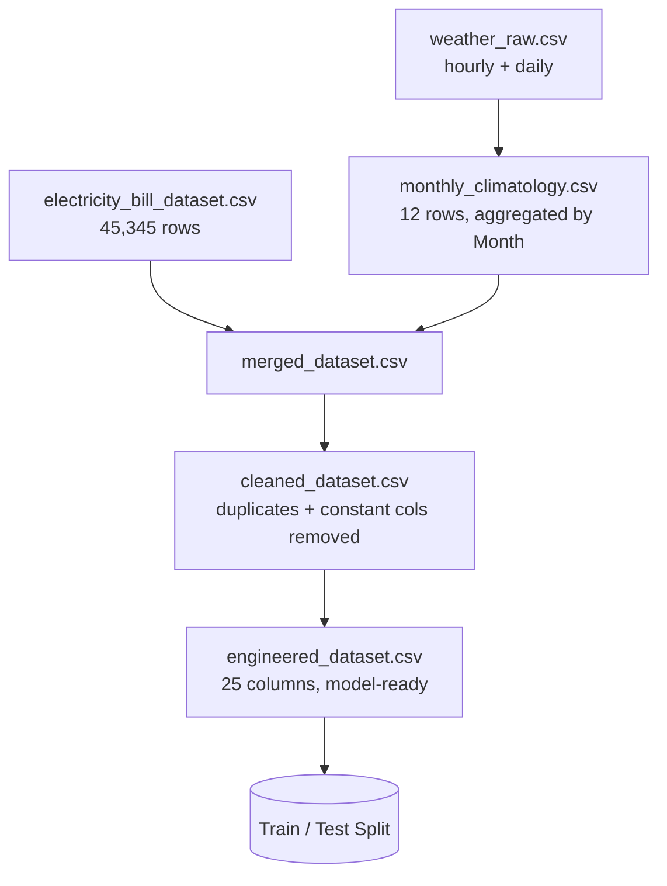

<div align="center">

# 📘 Dataset Documentation
### SPARK — Smart Power Analytics & Recommendation for Kilowatt Optimization

*Full data lineage, schema reference, and methodology notes*

</div>

---

## 📑 Table of Contents

- [Data Sources](#-data-sources)
- [Raw Schema Reference](#-raw-schema-reference)
- [Data Lineage](#-data-lineage)
- [⚠️ Critical Finding: Target Leakage](#️-critical-finding-target-leakage)
- [⚠️ Known Limitation: Weather Is a National Proxy](#️-known-limitation-weather-is-a-national-proxy)
- [Monthly Weather Climatology](#-monthly-weather-climatology)
- [Cleaning Decisions](#-cleaning-decisions)
- [Feature Engineering Reference](#-feature-engineering-reference)
- [Final Model Dataset — Data Dictionary](#-final-model-dataset--data-dictionary)
- [File Manifest](#-file-manifest)

---

## 🗂️ Data Sources

| # | Source | Type | Records | Role |
|---|---|---|---|---|
| 1 | `electricity_bill_dataset.csv` | Household appliance & billing data | 45,345 rows | Primary dataset — appliance usage, tariff, bill |
| 2 | `weather_raw.csv` (Open-Meteo Historical Weather API) | Hourly + daily weather, single location | 7,632 hourly / 318 daily rows | Supplementary — seasonal signal |

**Weather source location:** `21.968365°N, 78.981476°E` (elevation 696m, `Asia/Kolkata` timezone) — a central-India reference point, **not** tied to any specific city in the bill dataset. Date range: **24 Jan 2025 – 7 Dec 2025**.

## 📋 Raw Schema Reference

### `electricity_bill_dataset.csv`

| Column | Type | Range / Values | Description |
|---|---|---|---|
| `Fan` | int | 5 – 23 | Daily fan usage (hours) |
| `Refrigerator` | float | 17 – 23 | Daily refrigerator usage (hours) |
| `AirConditioner` | float | 0 – 3 | Daily AC usage (hours) |
| `Television` | float | 0 – 21 | Daily TV usage (hours) |
| `Monitor` | float | 1 – 12 | Daily monitor usage (hours) |
| `MotorPump` | int | 0 (constant) | Daily motor pump usage — **always 0**, dropped during cleaning |
| `Month` | int | 1 – 12 | Calendar month (no year — records are not tied to a specific year) |
| `City` | string | 16 unique values | Household's city (India) |
| `Company` | string | 32 unique values | Electricity distribution company |
| `MonthlyHours` | int | 95 – 926 | **Total summed appliance-running hours for the month** (not wall-clock hours — see note below) |
| `TariffRate` | float | 7.4 – 9.3 | Tariff rate (₹ per unit) |
| `ElectricityBill` | float | 807.5 – 8,286.3 | Monthly electricity bill (₹) |

> **Note on `MonthlyHours`:** values exceed 744 (the max wall-clock hours in a 31-day month) for 1,298 rows. This is expected and *not* a data error — appliances run in parallel, so `MonthlyHours` represents the **sum of running hours across all appliances**, not elapsed calendar time.

### `weather_raw.csv` (Open-Meteo export)

The file contains two stacked blocks:

| Block | Columns | Frequency |
|---|---|---|
| Location metadata | `latitude, longitude, elevation, utc_offset_seconds, timezone, timezone_abbreviation` | Single row |
| Hourly weather | `time, temperature_2m, relative_humidity_2m, apparent_temperature, precipitation, rain, snowfall` | Hourly |
| Daily weather | `time, temperature_2m_max, temperature_2m_min, temperature_2m_mean` | Daily |

## 🔗 Data Lineage



## ⚠️ Critical Finding: Target Leakage

During EDA, we found:

```
ElectricityBill = MonthlyHours × TariffRate      (exact, for all 45,345 rows, zero variance)
```

**Implication:** `ElectricityBill` is not an independent quantity to predict — it is a deterministic formula of two other columns. Using it as the ML target (with `MonthlyHours`/`TariffRate` available as features) would train a model that trivially reconstructs multiplication rather than learning real electricity-usage behavior, producing a meaningless R² ≈ 1.0.

**Resolution:** the ML target was changed to **`MonthlyHours`** (genuine consumption prediction). `ElectricityBill` is computed *after* prediction:

```
predicted_bill = predicted_MonthlyHours × TariffRate
```

`TariffRate` and `ElectricityBill` are excluded from the model's input feature list (`reports/feature_list.json`) to prevent this leakage from re-entering the pipeline.

## ⚠️ Known Limitation: Weather Is a National Proxy

The weather file contains data for **one fixed location only**, while the bill dataset spans **16 different cities** across India. There is no per-city coordinate table available.

**Decision (documented, not hidden):** weather is aggregated into a **Month-level national climatology** and joined to the bill dataset by `Month` alone — treated as a general seasonal reference signal, not a city-specific one.

**Validated impact:** this limitation turned out not to matter much in practice. EDA showed weather variables correlate at **<0.04** with `MonthlyHours`, and appliance usage (e.g. `AirConditioner`) shows **no seasonal variation** in the raw data either (1.48–1.53 avg daily hours across all 12 months). The dataset simply wasn't generated with a weather-dependent usage pattern, so the single-location limitation does not materially bias the results. See `reports/correlation_with_target.csv` for the full correlation table.

## 🌦️ Monthly Weather Climatology

Aggregated from the raw hourly/daily weather file (`notebooks/01_weather_climatology.py`):

| Month | Avg Temp Max (°C) | Avg Temp Min (°C) | Avg Temp Mean (°C) | Avg Humidity (%) | Avg Apparent Temp (°C) | Total Precipitation (mm) |
|---:|---:|---:|---:|---:|---:|---:|
| 1 | 28.04 | 14.31 | 20.45 | 57.36 | 19.92 | 0.0 |
| 2 | 29.79 | 16.62 | 22.77 | 41.27 | 21.13 | 0.1 |
| 3 | 34.58 | 20.43 | 27.15 | 24.91 | 24.57 | 0.0 |
| 4 | 37.38 | 23.84 | 30.40 | 27.19 | 28.69 | 2.1 |
| 5 | 34.77 | 24.16 | 28.78 | 53.87 | 30.51 | 72.7 |
| 6 | 32.51 | 24.13 | 27.73 | 64.58 | 29.59 | 123.9 |
| 7 | 28.04 | 22.55 | 24.79 | 84.82 | 27.48 | 327.8 |
| 8 | 28.42 | 22.35 | 24.84 | 85.18 | 28.32 | 202.0 |
| 9 | 28.47 | 22.18 | 24.66 | 85.07 | 28.12 | 159.8 |
| 10 | 28.65 | 20.46 | 24.05 | 73.39 | 26.03 | 62.1 |
| 11 | 26.67 | 14.78 | 20.15 | 58.45 | 19.50 | 3.0 |
| 12 | 24.83 | 12.54 | 17.79 | 53.62 | 15.78 | 0.0 |

The pattern is physically sensible for central India — hot pre-monsoon peak in April/May, heavy monsoon rainfall July–September, cool December/January — which confirms the climatology itself is valid, even though it doesn't end up correlating with consumption in this particular dataset.

## 🧹 Cleaning Decisions

Logged in full at `reports/data_cleaning_log.json`.

| Check | Result | Action |
|---|---|---|
| Duplicate rows | 0 | None needed |
| Negative values | 0 across all usage columns | None needed |
| Constant columns | `MotorPump` (always 0) | **Dropped** — zero variance, no predictive value |
| `MonthlyHours` > 744 | 1,298 rows | **Not treated as an error** — see explanation above |
| IQR outliers: `Refrigerator`, `Monitor` | 8,274 / 8,971 rows flagged | **Not removed** — these are low-cardinality, near-constant columns; IQR's narrow interquartile range over-flags normal values here. A known limitation of IQR on discrete/skewed distributions, not a real data quality issue. |
| IQR outliers: `MonthlyHours`, `ElectricityBill` | 115 / 161 rows flagged | Kept — genuine tail values; tree-based models handle these natively |

## 🧪 Feature Engineering Reference

All engineered features are built **only** from appliance usage, `Month`, `City`, and `Company` — never from `MonthlyHours`, `TariffRate`, or `ElectricityBill`, to avoid reintroducing leakage.

| Feature | Formula / Logic | Rationale |
|---|---|---|
| `Total_Appliance_Hours` | Sum of `Fan + Refrigerator + AirConditioner + Television + Monitor` | Strongest single predictor found (r = 0.710) — `MonthlyHours` is itself a sum-like quantity |
| `Estimated_Load_kWh` | `(Fan×75 + Refrigerator×150 + AC×1500 + TV×100 + Monitor×30) / 1000` | Physically-informed load index using typical Indian household appliance wattages (W) |
| `Month_sin`, `Month_cos` | `sin(2π·Month/12)`, `cos(2π·Month/12)` | Cyclical encoding so December and January are treated as adjacent, not distant |
| `Season` | Winter (12,1,2) / Summer (3–6) / Monsoon (7–9) / Post-Monsoon (10,11) | Indian climate seasonal grouping |
| `City_Encoded` | Label encoding of `City` | Numeric representation for modeling |
| `Company_Encoded` | Label encoding of `Company` | Numeric representation for modeling |
| `Season_Encoded` | Label encoding of `Season` | Numeric representation for modeling |

**Assumed appliance wattages** (documented, approximate, India-typical):

| Appliance | Wattage |
|---|---:|
| Fan | 75 W |
| Refrigerator | 150 W |
| Air Conditioner | 1,500 W |
| Television | 100 W |
| Monitor | 30 W |

## 📖 Final Model Dataset — Data Dictionary

`data/engineered_dataset.csv` (45,345 rows × 25 columns)

| Column | Used as Model Input? | Notes |
|---|:---:|---|
| `Fan`, `Refrigerator`, `AirConditioner`, `Television`, `Monitor` | ✅ | Raw appliance hours |
| `Total_Appliance_Hours` | ✅ | Engineered — top feature (84.9% importance) |
| `Estimated_Load_kWh` | ✅ | Engineered — wattage-weighted load |
| `Month_sin`, `Month_cos` | ✅ | Engineered — cyclical month |
| `City_Encoded`, `Company_Encoded`, `Season_Encoded` | ✅ | Encoded categoricals |
| `Month` | ❌ | Raw — superseded by cyclical encoding |
| `City`, `Company`, `Season` | ❌ | Raw string — superseded by encoded versions |
| `TariffRate` | ❌ **(excluded — leakage)** | Retained only for post-hoc bill calculation |
| `ElectricityBill` | ❌ **(target of leakage — never a feature)** | Used only for business-insight commentary |
| `MonthlyHours` | 🎯 **Target** | What the model predicts |
| `Avg_Temp_Max`, `Avg_Temp_Min`, `Avg_Temp_Mean`, `Avg_Humidity`, `Avg_Apparent_Temp`, `Total_Precipitation` | ❌ | Weather climatology — retained for transparency, not used as inputs (near-zero correlation with target, see above) |

## 🗃️ File Manifest

| File | Produced By | Description |
|---|---|---|
| `data/monthly_climatology.csv` | `01_weather_climatology.py` | 12-row Month-level weather aggregation |
| `data/merged_dataset.csv` | `02_merge_data.py` | Bill data + weather, joined on Month |
| `data/cleaned_dataset.csv` | `03_cleaning.py` | Deduplicated, constant columns removed |
| `data/engineered_dataset.csv` | `05_feature_engineering.py` | Final model-ready dataset |
| `reports/data_cleaning_log.json` | `03_cleaning.py` | Cleaning decisions log |
| `reports/eda_business_insights.json` | `04_eda.py` | Auto-generated EDA insights |
| `reports/correlation_with_target.csv` | `04_eda.py` | Full correlation table vs. `MonthlyHours` |
| `reports/feature_list.json` | `05_feature_engineering.py` | Official model feature list + leakage exclusions |
| `reports/feature_importance.csv` | `08_evaluation.py` | Feature importances from best model |
| `reports/model_performance_comparison.csv` | `07_model_training.py` | All 7 models' metrics |
| `models/best_model.pkl` | `07_model_training.py` | Trained Gradient Boosting regressor |
| `models/scaler.pkl` | `06_train_test_split.py` | StandardScaler fit on training data |
| `models/label_encoders.pkl` | `05_feature_engineering.py` | LabelEncoders for City / Company / Season |
| `models/model_meta.json` | `07_model_training.py` | Feature list, target, best model + metrics |

---

<div align="center">

*Part of the SPARK project — see [`README.md`](../README.md) for the full project overview.*

</div>
